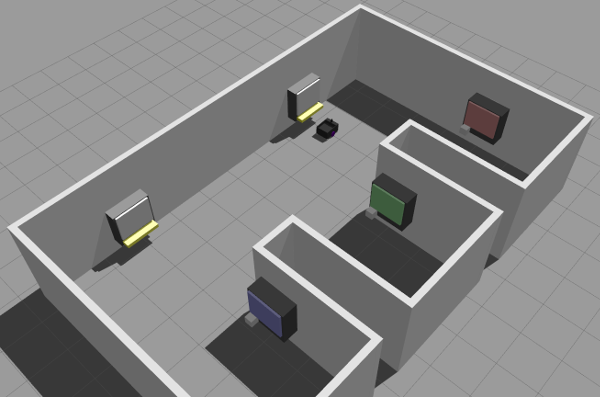
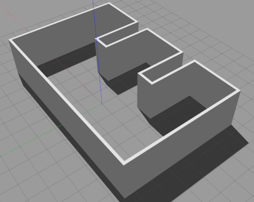
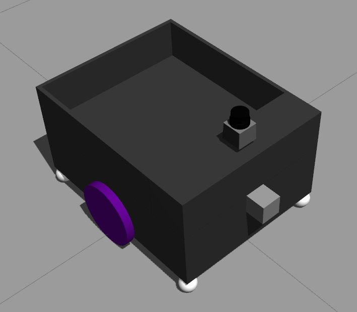
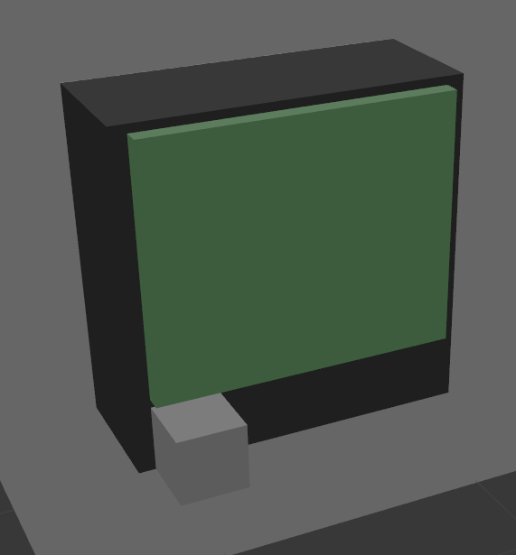
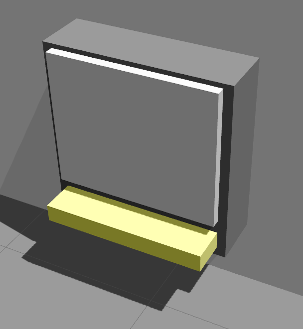
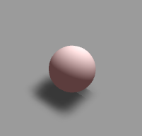

# warehouse_robot_simulation



This project consists of a automated warehouse simulation with an autonomous mobile robot that handles `Orders` requests to get the required `Products` at the `Storages` available and deliver them in the right `Dispatch` area.

> This project were developed to be presented as the "Capstone Project" of Udacity C++ Engineer Nanodegree program. I chose to develop this project in the mobile robotics context with everything I've learned from the Udacity Robotic Software Engineer Nanodegree program, which I had the chance to develop a home service robot simulation (repo [here](https://github.com/rodriguesrenato/rse-nd-home-service-robot)) that navigates autonomously between two goals pose.

# Dependencies

This project was built and was run on Ubuntu 18.04.5 LTS. The following dependencies/packages are required:

- gcc/g++ >= 7.5.0
- make >= 4.1
- cmake >= 2.8
- ROS Melodic
- Gazebo 9.17.0
- ROS Melodic Packages:
    - amcl
    - move_base
    - map_server
    - gmapping (optional)
    - teleop_twist_keyboard (optional)

# Installation

Assuming your catkin workspace `catkin_ws` is located in `/home/workspace/`, clone this repository and the official repositories bellow in src folder of your catkin workspace:

```bash
cd /home/workspace//catkin_ws/src
git clone https://github.com/rodriguesrenato/warehouse_robot_simulation.git
```

- Optional: If you plan to build and mapping a new map for this simulation, then also clone the following repositories:
    ```
    git clone https://github.com/ros-perception/slam_gmapping.git
    git clone https://github.com/ros-teleop/teleop_twist_keyboard
    ```
- Note: If a different project directory was chosen, then you have to manually change the `projectDirectory` value in the `src/warehouseSimulation.cpp` file before build it. It was considered that ROS executes nodes in `~/.ros` to use relative paths.

>  For Udacity workspace,`projectDirectory` has to be set with value `/home/workspace/catkin_ws/src/warehouse_robot_simulation`.

Then build and source it:

```bash
source /opt/ros/kinetic/setup.bash
cd /home/workspace/catkin_ws
catkin_make
source devel/setup.bash
```

Finally, make script files executable before run them:

```bash
cd /home/workspace/catkin_ws/src/warehouse_robot_simulation/scripts
chmod +x *.sh
```

# Usage

> For Udacity workspace, on workspace startup, you have to run once `pip install rospkg` to install this python package and source ROS on each terminal opened before run any command in this section by running these two follow commands: `source /opt/ros/kinetic/setup.bash` and `source /home/workspace/catkin_ws/devel/setup.bash`.

To run the simulation, open a terminal in the `scripts` folder and run `warehouse_simulation.sh`:

```bash
source /opt/ros/kinetic/setup.bash
cd /home/workspace/catkin_ws/src/warehouse_robot_simulation/scripts
./warehouse_simulation.sh
``` 

- This script will launch the following `.launch` files in the specified sequence bellow:

    1. `roslaunch warehouse_robot_simulation world.launch`: Launch Gazebo and load the world `warehouse.world` file.
    2. `roslaunch warehouse_robot_simulation robot_spawner.launch`: Spawn the robot in the simulation.
    3. `roslaunch warehouse_robot_simulation amcl.launch`: Start AMCL and move_base nodes.
    4. `roslaunch warehouse_robot_simulation warehouse_simulation.launch`: Start the warehouse simulation.

The only way to interact externally with the simulation is to publish an `Order` message via ROS topic `/warehouse/order/add`. `Order` message will be received by the running `OrderController`.

The simplest way is to directly publish a message to ros in the terminal. The `Order` is defined as a one line plain string following this pattern: `target_dispatch_model_name product product_quantity product_n product_n_quantity`

So to publish the following example Order: `DispatchA ProductR 3 ProductG 5`, then run on a terminal:

```bash
source /opt/ros/kinetic/setup.bash
rostopic pub /warehouse/order/add std_msgs/String "data: 'DispatchA ProductR 3 ProductG 5'"
```

- The command line above will place an `Order` in the simulation that contains 3 `ProductR` and 5 `ProductG` to be dispatched at `DispatchA`.

- The following model objects available for build orders:
    - Products: `ProductR`,`ProductG` and `ProductB` 
    - Dispatches: `DispatchA` and `DispatchB` 

- If you try to send an Order with invalid Dispatch, Product or quantity, this order will be discarded

To end the simulation, just hit **CTRL+C** on the terminal that is running WarehouseSimulation node and wait until it finishes the shutdown procedure.

## Optional

If you want to check the navigation in rviz, run: 

```
roslaunch warehouse_robot_simulation view_navigation.launch
```

If you want to generate a new map files using SLAM gmapping, follow the step bellow:

- Open terminal in scripts fodler and run the mapping script: `./mapping_slam.sh` 
    - It launches the world and robot in Gazebo, then runs `slam_gmapping.launch`

- Navigate robot using teleop keyboard through your map until cover most of the areas. If the generated map showed in Rviz isn't good enough, adjusts gmapping params in `slam_gmapping.launch` file and restart this process.

- If the generated map showed in Rviz is good enough, open a new terminal, change director to the `map` folder of this project, then save your new map by running the following command:

```
rosrun map_server map_saver -f warehouse.
```

# Simulation

The simulation has the following main components:
- Warehouse world in Gazebo
- URDF Robot
- AMCL and Navigation nodes
- WarehouseSimulation ROS node

## Warehouse World



The world was built in a simplified version of a warehouse and was designed in a way that Storages area will be at the right side of the image above and Dispatch areas on the left, so robot will have to navigate through aisles to get the products and deviler them on the left side of the open area, similar to some logistics warehouse configurations.

## URDF Robot



The robot was designed in a two wheeled configuration with ball caster wheels at edges, a cargo bed at the back and two sensors for mapping and localization (camera and Lidar). 

It was built using URDF format and .xacro files, based and improved from my previous project [home_service_robot](https://github.com/rodriguesrenato/rse-nd-home-service-robot) by adding some macro functions to help adusting parameters and calculating inertial values.

## Mapping, Localization and Navigation nodes

These nodes were based on [home_service_robot](https://github.com/rodriguesrenato/rse-nd-home-service-robot) project.

SLAM `gmapping` package were used to build the warehouse map. The map is loaded with `map_server` package, the localization is done with `AMCL` package and navigation with `move_base` package.
Navigation parameters were based on the koburi/turtlebot navigation parameters as a starting point and they were tuned for this application. The `inflation_radius` param was increasead to avoid naviagation too close to the walls and ground objects


## WarehouseSimulation ROS node

This is the main simulation node and was developed using ROS with C++. All objects in the simulation are instantiated/handled in the warehouseSimulation node, except the robot and localization/navigation nodes that has to be launched previously. The list bellow shows the node main operation flow.

1. Initialize the WarehouseSimulation node and create the warehouse controllers and objects. 

2. All SDF models that will be used in the simulation are loaded and its file content stored in a dictionary of `modelname:fileContent` by the modelController class. The model files can be found at `models/warehouseObjects` folder.

3. Read the storages and dispatches configuration files to add Storage and Dispatch objects to the simulation. These objects are defined on each line in the configuration files. InstatiateWarehouseObjects function process these configuration files line by line, construct the correspondent object with the values read and push it back to the correspondent object's vector. If any exception/problem occurs during this process, the simulation is aborted.

4. Create a `Robot` object and configure it. The simulation was made to handler multiple robots, but in this current version just one robot is used. Check `Robot` constructor for more information about the parameter needed to set multiple `Robots`.

5. Iterate over each `Storage`, `Dispatch` and `Robot` created in order to Start Operation threads and/or spawn it's object model in Gazebo simulation. `Storage` Operation thread is responsible for keeping `Storage` producing `Products` to it's max capacity. `Robot` Operation thread is responsible for cycle through tasks to execute `Orders` and interact with all other warehouse objects.

6. Set a ROS subscriber at topic `warehouse/order/add` to receive `Order` requests and send it to `OrderController::AddOrder`. This subscribe function opens a new thread internally to call the AddOrder member function of `OrderController`, which is passed as reference.

7. Set a new `SIGINT` handler to let the simulation call `ModelController::Delete` of all models that were previously spawned before a complete ros shutdown. `ros::init` at step 1. was set with the flag `ros::init_options::NoSigintHandler` to let a custom handler be set.

8. A while loop keeps calling `ros::spinOnce()` to process a single round of ROS callbacks until global variable `isShutdown` is set or ROS shutdown.

9. When **CTRL+C** is hit,`isShutdown` is set true, iterates over all Storage, Dispatch and Robot to call delete models from Gazebo simulation

10. After Delete spawned models in Gazebo, then completely shutdown this ros node by calling `ros::shutdown()`


## C++ Classes Structue

A brief explanation of each implemented class
- Program C++ Classes
    - WarehouseObject
    - Robot
    - Storage
    - Dispatch
    - Product
    - Order
    - OrderController
    - ModelController

### WarehouseObject

This is the base class for all objects and controller of this simulation. It is responsible for generating a unique id, printing messages in the terminal protected by a mutex through `Print()` member function, retrive it's unique name through `GetName()` and storing all started threads in a vector to build a thread barrier on it's Destructor. It was implemented a way of programatically end objects (`Storage` and `Robot`) member functions that were started in threads (explained in next sections).

### Robot


In this simulation, a two wheeled mobile Robot is used. It has a cargo bed at the back to carry `Products`, a Lidar and camera sensors to localize itself in the enviroment and navigate, and it can interact with other `Warehouse Objects`.

The `Robot` class has a member functions to set/return it's status, return a list of Product names that is in the cargo bed and the StartOperation member function responsible for start a thread running `Operate()`. It also has private member functions that builds a vector of Storages that have the Products in the current order; interacts with SimpleActionClient to move the robot; and operate robot throught RobotStatus.

In the `Operate()` private member function, a state machine of `RobotStatus` was implemented, which runs continuously until _status be set as `offline`. Each `RobotStatus` is responsible for a task listed bellow. Some operation variables are created before the state machine scope to be persistent between states looping. It was made with this strategy to continuously check if the robot _status was set to `offline` and then terminate this thread. When `Robot` Destructor is called, it set _status to `offline`.

Available `RobotStatus` tasks: 

- `offline`: Robot is not operable and shutdown.

- `startup`: Initialize the SimpleActionClient and wait until it gets ready to change the _status to `requestOrder`.

- `standby`: Just wait until _status change.

- `requestOrder`: Request OrderController an Order and change _status to `processOrder` if got one.

- `processOrder`: Clear operation variables, get the list of Storages to get Order Products and get the target Dispatch shared pointer. If it couldn't find any Storages to go or a valid Dispatch, then set _state to `closeOrder`.

- `plan`: at this state, set the next target Storage, remove this Storage from storagesToGo vector and set _state to `moveToStorage`. If storagesToGo gets empty, then set _state to `moveToDispatch`.

- `moveToStorage`: Move robot to the Storage product output pose. If it reaches the goal, then set _status to `requestProduct`, otherwise try again in next state machine interation.

- `requestProduct`: Call `RequestProduct()` member function of the target Storage until the gets the number of valid Products specified in the Order. `RequestProduct()` return a **unique_ptr<Product>** that will be moved to Robot `_cargoBinProducts` attribute, passing Product's ownership from Storage to Robot. When the storage don't have a Product available, it will return a nullptr, that will not be counted and added to `_cargoBinProducts`.

- `moveToDispatch`: Move robot to the Dispatch product picking pose. If it reaches the goal, then set _status to `dispatchOrder`, otherwise try again in next state machine interation.

- `dispatchOrder`: Call target Dispatch `PickProduct()` member function moving Products in `_cargoBinProducts` one by one, passing Product's ownership from Robot to Dispatch, until `_cargoBinProducts` gets empty. After that, set _status to `closeOrder`.

- `closeOrder`: Close this order and set _state to `requestOrder` to request a new one.

### Storage



The `Storage` class is responsible for Products production, storage and handling, defined on the class Constructor. 

The `Production()` private member function continuously produces a specified `Product` until gets max capacity. This function is started in a thread by `StartOperation` public member function.

The `RequestProduct()` public member function handles `Products` requests to spawn a `Product` at a specified `Product Output Pose`. It returns a `std::unique_ptr<Product>` that was produced, passing the ownership from Storage to the caller.

It also has member functions to return it's pose and model name, and it's product output pose and model name.

### Dispatch



The `Dispatch` class is responsible for picking all Order Products from robot when requested by it's `PickProducts()` member function.

It also has member functions to return it's pose and model name, and the pose to pick product.

### Product



The `Product` class is a simple representation of the products that will be handled during this simulation. It stores the product model name that is returned by `GetModelName()` member function.

### Order

The `Order` class represents a single Order 'recipe' that contains the target Dispatch and an unordered map of Products and the respective quantities. It also store the information of which robot name is handling this Order.

### OrderController

The `OrderController` is responsible for the management of the queue of Orders received and requested. 

The Orders are added to the queue by `AddOrder()` member function, which is set as the callback function of the node handle subcribe function on the topic `warehouse/order/add`. To add an Order, publish a plain text on this topic following this sequence pattern, separating itens by a single space:

`target_dispatch_model_name product product_quantity product_n product_n_quantity`

Robots can request an Order in queue by calling `RequestNextOrder()` or `RequestNextOrderWithTimeout()`. In both member functions were implemented a conditional variable to wait for an Order available in the queue and avoid concurrency issues. The `RequestNextOrderWithTimeout()` is set an timeout time to avoid being stuck waiting for an Order and it's state machine implementation calls this function multiples times before gets the Order available. That permits the robot to do other tasks until an Order is available.

For a future implementation of a graphical orders monitor, the function `GetOrdersTracking()` returns all Orders that are being handled by robots. That is the reason that Orders are created as `std::shared_ptr<Order>`, so it will make possible for an Order be processed collaboratively between multiple robots and the main controller.

### Model Controller

The `ModelController` class is responsible for interacting with Gazebo simulation .

The `Add()` member function reads models XML file content and store it in a unordered map associated with it's model name as the key value.

The `Spawn()` member function receive the unique object name, the object's model name and the desired pose for the object to be spawned. This function gets the pre loaded model XML of the desired model name previously loaded and call the `GazeboSpawn()` private function, which is responsible for calling a ros service on `gazebo/spawn_sdf_model` topic with the right parameters to spawn this object in the simulation.

The `Delete()` member function works likewise `Spawn()`, it calls `GazeboDelete()` private member function , which is responsible for calling a ros service on `gazebo/delete_model` topic for delete the object from simulation.

There is also the `ReadModel()` private member function that reads a file at the specified filepath, convert the whole file content to string format and return it. This function is used by `Add()`.

# Modern C++ Features Implemented

- All classes were designed and built using OOP. 

- The warehouseObject class was designed to have common features and information between all other classes, like an `objectName` and a `Print()` function protected by a mutex. When the Destructor is called, it makes a thread barrier to guarantee that all started threads by the child class are finish before it goes out of scope.

- The `WarehouseObject::Print()` is responsible to standarize the `std::cout` output in the format `[ObjectName] message`.

- Two configuration files were created to define how many `Storages` and `Dispatches` will be created and also configure each of them, so it not needed to hardcode this configurations. These files are processed in the `warehouseSimulation.cpp`.

- In the files read operations, a try catch expression was set to prevent from load wrong `Storage` and/or `Dispatch` configurations and string to int/float exceptions. In this case, it warns the user to fix the respective configuration file and finish the simulation before spawn any model to Gazebo.

- All SDF models that will be used in the simulation are loaded and stored it's file XML content in the `ModelController` class to avoid read files multiple times. They are stored in a unordered_map dictionary, the keys of the content are the files name. The file name is defined as the model name.

- All classes are instantiated as **shared pointers**, except the `Product` class. `Products` are unique objects in the simulation and only one class has to have the ownership of it, so they are always instantiated as **unique pointers** and **std::move** are used to pass its ownership between warehouse objects.

- The **shared pointers** of classes created are copied to local member attributes in it's Constructor, to be used inside the class by it's member functions.

- `Storage` and `Robot` class start threads in the simulation by it's `StartOperation()` member functions. 

    - `Storage::StartOperation()` starts a thread to run the private member function `Production()`. This function runs an while loop until private attribute `_productionModelName` is empty (when Destructor is called,`_productionModelName` is cleared to finish this thread programatically). This loop keeps adding new `unique_ptr<Product>`, at a fixed rate of 2 seconds, to the private attribute `_storedProducts` until it reachs `_maxCapacity`.

    - `Storage::_storedProducts` is always read/modified after a lock_guard be created with `Storage::_storageMtx` mutex. 

    - `Robot::StartOperation()` starts a thread to run the private member function `Operate()`. This function runs an while loop until private attribute `_status` is empty (when Destructor is called,`_status` is set to `RobotStatus::offline` to finish this thread programatically).
    This loop is responsible to cycle through RobotStatus tasks, designed to be a state machine behavior model. This approach was made to make possible multiple behaviours paths, accept external commands to change plans and constantly check when this thread needs to be eneded.

    - `Robot::_cargoBinProducts` is always read/modified after a lock_guard or unique_lock be created with `Robot::_cargoBinMtx` mutex.

- The `ModelController` class was built to handler everything related to Gazebo and it makes direct ros service calls to spawn and delete models form Gazebo. Due to complexity, robot spawing depends on other ros nodes like amcl and move_base, so this feature will be added in a future version.

- The `OrderController` implements a queue that uses a **condition variable** and a **mutex** (`OrderController::_queueMtx`) to handle `Order` requests protected from concurrency bugs. 

- The `OrderController::AddOrder()` receives a string message from ros and process it with `std::istringstream` to parse values and build the `Order`. This `Order` is added to the `OrderController::_queue` under the lock using `std::lock_guard` with the `OrderController::_queueMtx` mutex.

- `Order` and `Product` classes are just simple classes that store it's object informations and be shared/moved throught other warehouse objects.

- The `Dispatch::PickProduct()` member function just receive the moved `std::unique_ptr<Product>` and let this `Product` destructs at the end of scope. It's done because we don't have any action to do with this `Product` later in the simulation.

# Project Rubrics points

> The submission must compile and run.
 
- To work on the Udacity workspace, some path adjusts had to be made in the script file on the declared path (sourcing kinetic instead of melodic)
- There is a screenshot of this project running on the Udacity workspace.
- Rviz visualization was removed from the script due to high processing.

## Loops, Functions, I/O

> The project demonstrates an understanding of C++ functions and control structures.

- The project classes were well organized accordingly to their purpose in the simulation

> The project reads data from a file and process the data, or the program writes data to a file.

- `ModelController` class reads SDF model files and `WarehouseSimulation.cpp` reads two configuration files on local function `InstatiateWarehouseObjects`.

## Object Oriented Programming

> The project uses Object Oriented Programming techniques.

- All classes were uses OOP and they are used in the `warehouseSimulation.cpp`.

> Classes use appropriate access specifiers for class members.

- All member attributes are accessed/modified externally by accessor and mutator functions.

> Classes abstract implementation details from their interfaces.

> Classes encapsulate behavior.

> Classes follow an appropriate inheritance hierarchy.

- All classes have `WarehouseObject` class as parent class

## Memory Management

> The project makes use of references in function declarations.

> The project uses destructors appropriately.

- `WarehouseObject` class uses Destructor to build a thread barrier and wait for all started threads finish.
- On `Storage` and `Robot` class, the Destructor is used to set a member attribute to a value that will trigger all started thread by them to terminate during their internal cycles.

> The project uses move semantics to move data, instead of copying it, where possible.

- std:move is used to move `std::unique_ptr<Products>` objects between `Robot` (Robot.cpp line 278, 323), `Storage` (Storage.cpp line 57, 60, 91) and `Dispatch` objects. It's also used in `OrderController.cpp` (line 76, 113, 412) to move `Orders` in/out the `_queue` member attribute.

> The project uses smart pointers instead of raw pointers.

- Shared pointers are widely used and unique pointer is used to handler `Product` class.

## Concurrency

> The project uses multithreading.

- `Storage.cpp` (line 72) and `Robot` (line 76) start threads in the simulation by it's `StartOperation()` member functions.

> A mutex or lock is used in the project.

- In `WarehouseObject.cpp` (line 38) to print to std::cout under the lock by using the `_coutMtx` mutex with `std::lock_guard`.

- In `Storage.cpp` (lines 51, 86) to protected `_storedProducts` of concurrent access/modification by `Storage::Production()` and `Storage::RequestProduct()`.

- In `Robot.cpp` (lines 58, 277, 322) to protected `_cargoBinProducts` of concurrent access/modification by `Robot::Operate()` and `GetCargoBinProductsName()`.

- In `OrderController.cpp` (lines 75, 108, 132) to protect deque `_queue` and (lines 87, 98, 119, 148) to protect vector `_ordersTracking` from concurrent access/modification

> A condition variable is used in the project.

- It is used in `OrderController.cpp` to handler `Order` request from `Robots` (lines 109, 133) and to notify when a `Order` was added to the `_queue` (lines 77).

# Next Features to be Implemented

- Launch robot and correspondent amcl/move_base nodes from the warehouseSimulation node
- Design a complete operational Dashboard with ncurses to keep track of all warehouse objects
- Multiple robots in simulation
- Test other path planning algorithms to define 'lanes' and a waitting line at Storages and Dispatches.

# License

The contents of this repository are covered under the MIT License.

# References

- Ros wiki: (http://wiki.ros.org/)
- C++ references: (https://www.cplusplus.com/)
- How to add compiler option `pthreads` in ros: (https://stackoverflow.com/questions/67300703/how-do-i-use-the-pthreads-in-a-ros-c-node)